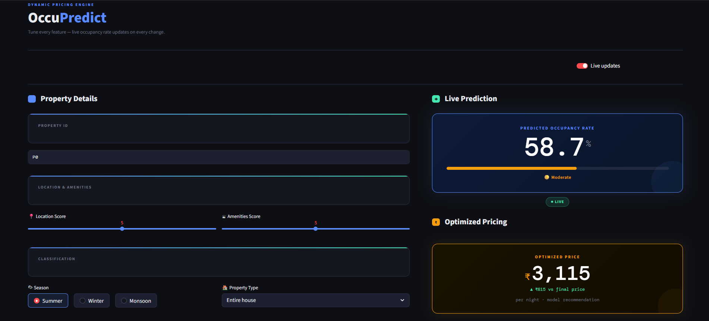
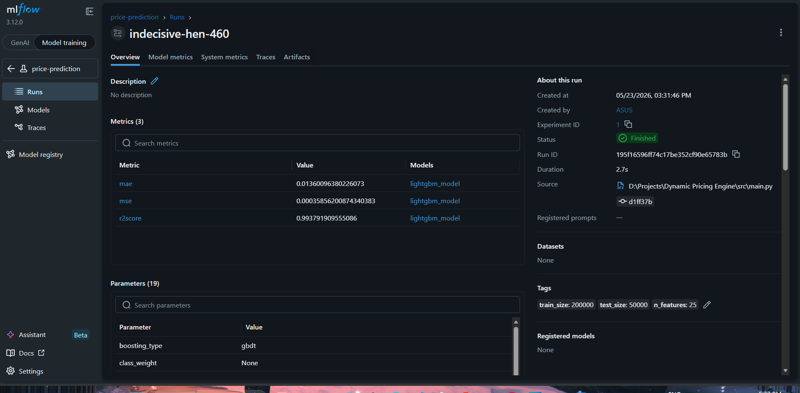
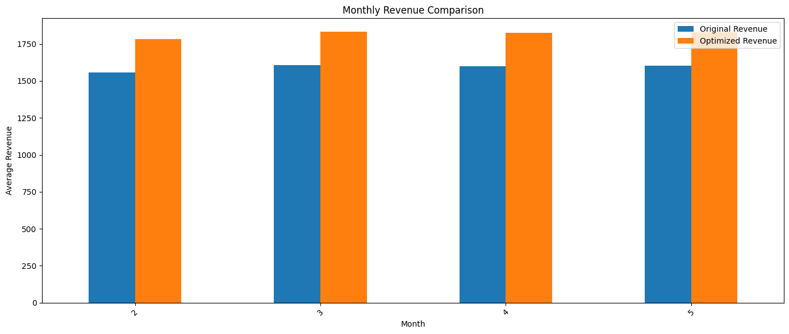

# Dynamic Pricing Engine

An end-to-end AI-powered Dynamic Pricing Engine that predicts occupancy rates and optimizes property pricing to maximize revenue under changing market conditions.

The project simulates real-world hotel/Airbnb pricing systems by combining:
- Machine Learning
- Revenue Optimization
- Automated Retraining Pipelines
- MLOps Workflows
- REST APIs
- Interactive Dashboards

---

# Features

## ML-Based Occupancy Prediction
Predicts occupancy rate using:
- Property quality
- Seasonal demand
- Competitor pricing
- Market trends
- Events & holidays
- Historical demand patterns

---

## Dynamic Price Optimization
Optimizes pricing dynamically to:
- Increase occupancy
- Maximize revenue
- Adapt to market conditions

---

## Automated ML Pipeline
Includes:
- Synthetic dataset generation
- Feature engineering
- Model training
- Evaluation
- MLflow experiment tracking
- Automated retraining with GitHub Actions

---

## Interactive Frontend Dashboard
Streamlit dashboard for:
- Real-time inference
- Revenue simulation
- Price optimization
- Visualization

---

## REST API Backend
FastAPI backend serving:
- Occupancy prediction
- Dynamic pricing inference
- Optimization endpoints

---

# Project Architecture

```text
User
 ↓
Streamlit Frontend
 ↓
FastAPI Backend
 ↓
Prediction + Optimization Engine
 ↓
LightGBM Model
 ↓
MLflow Experiment Tracking
 ↓
GitHub Actions Automated Retraining
```

---

# Tech Stack

## Machine Learning
- LightGBM
- Scikit-learn
- Pandas
- NumPy

---

## Backend
- FastAPI
- Uvicorn

---

## Frontend
- Streamlit

---

## MLOps / Automation
- MLflow
- GitHub Actions
- uv package manager

---

# Dataset Generation

The project uses a synthetic dataset generation pipeline simulating real-world property pricing dynamics.

Generated features include:

| Feature | Description |
|---|---|
| property_type | Entire house / Private room / Luxury suite |
| location_score | Property location quality |
| amenities_score | Quality of amenities |
| rating | Property rating |
| season | Summer / Winter / Monsoon |
| holiday | Holiday indicator |
| weekend | Weekend indicator |
| demand | Simulated market demand |
| competitor_price | Competitor pricing |
| nearby_event | Event indicator |
| market_trend | Market movement trend |
| occupancy_rate | Simulated occupancy |
| revenue | Calculated revenue |

---

# Feature Engineering

Additional engineered features:

- Lag Features
- Rolling Window Features
- One-Hot Encoded Categorical Features
- Temporal Features
- Historical Price Trends

Examples:
- occupancy_lag_1
- rolling_7_day_demand
- rolling_30_day_price

---

# Model Training

The project currently uses:
- LightGBM Regressor

Target:
- Occupancy Rate Prediction

Evaluation Metrics:
- MAE
- MSE
- R² Score

---

# Model Performance

| Metric | Score |
|---|---|
| MAE | ~0.013 |
| MSE | ~0.00038 |
| R² Score | ~0.993 |

---

# Revenue Optimization Results

The optimized pricing strategy produced:
- Increased average occupancy stability
- Revenue uplift over baseline pricing

Example Results:

| Metric | Original | Optimized |
|---|---|---|
| Average Revenue | 1591 | 1817 |
| Average Price | 2401 | 2138 |

Approximate revenue uplift:
- ~21%

---

# MLflow Experiment Tracking

MLflow is used for:
- Experiment tracking
- Parameter logging
- Metric logging
- Artifact tracking
- Model version tracking

Tracked artifacts include:
- Trained models
- Feature importance
- Evaluation plots
- Metrics

Run locally:

```bash
mlflow ui
```

Open:
```text
http://localhost:5000
```

---

# Automated Retraining Pipeline

GitHub Actions automatically:
- Generates new market data
- Retrains the model
- Evaluates performance
- Uploads artifacts
- Updates production model

Workflow location:

```text
.github/workflows/retrain.yml
```

Scheduled retraining simulates:
- Concept drift
- Market changes
- Dynamic competitor behavior

---

# API Endpoints

## Health Check

```http
GET /health
```

---

## Predict Occupancy

```http
POST /predict-occupancy
```

Example Request:

```json
{
  "location_score": 8,
  "amenities_score": 7,
  "rating": 4.5,
  "base_price": 2500,
  "demand": 0.75,
  "competitor_price": 2400,
  "market_trend": 0.82
}
```

---

# Frontend Dashboard

The Streamlit dashboard allows users to:
- Simulate property pricing
- Predict occupancy
- Optimize prices
- Visualize revenue trends

---

# Local Setup

## Clone Repository

```bash
git clone https://github.com/ShaunakMore/dynamic-pricing-engine
cd dynamic-pricing-engine
```

---

## Install Dependencies

Using uv:

```bash
uv sync
```

---

## Run Backend

```bash
uv run uvicorn app.main:app --reload
```

---

## Run Frontend

```bash
uv run streamlit run frontend/streamlit_app.py
```

---

# Deployment

## Frontend
Hosted using:
- Streamlit Cloud

---

## Backend
Hosted using:
- Render

---

# Project Structure

```text
dynamic-pricing-engine/
│
├── app/
│   ├── main.py
│   ├── schemas/
│   └── services/
│
├── frontend/
│   └── streamlit_app.py
│
├── src/
│   ├── data_pipeline/
│   ├── feature_engineering/
│   ├── training/
│   ├── optimization/
│   └── utils/
│
├── models/
├── data/
├── mlruns/
├── .github/workflows/
├── pyproject.toml
└── README.md
```

---

# Future Improvements

Potential future upgrades:
- Real-world Airbnb/Booking.com scraping
- Reinforcement Learning based pricing
- Online learning pipelines
- Distributed retraining
- Time-series forecasting models
- LSTM/Transformer models
- Real-time competitor monitoring

---

# Key Learning Outcomes

This project demonstrates:
- End-to-end ML system design
- Feature engineering
- Revenue optimization
- MLOps workflows
- Automated retraining
- Experiment tracking
- REST API development
- Frontend + backend integration
- CI/CD pipelines

---

# Screenshots

## Streamlit Dashboard


---

## MLflow Experiment Tracking


---

## Revenue Optimization Visualization


---

# Author

Shaunak More

Bachelor of Computer Science Student  
Machine Learning • MLOps • Systems Engineering

---

# License

MIT License